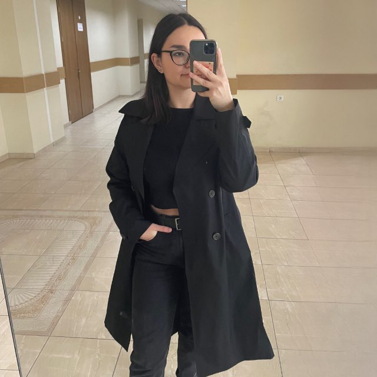

# Hello!
Каварналы Анастасия

## Коротко обо мне
- Студентка 2 курса прикладной информатики в USM
- Начинаю изучать программирование с нуля
- У меня гуманитарный профиль, поэтому в программирование вхожу постепенно, но продолжаю изучать
- Трудолюбивая и настроена на результат
- На данный момент больше всего интересует Front-end разработка

## Области интересов

- Front-end разработка 
- UI/UX и удобство интерфейсов
- Адаптивная верстка

## Языки программирования и технологии

### Знаю

- базовый уровень:
  - HTML
  - CSS
  - Python

### Изучаю

 - основы JavaScript
 - Базы данных (SQL) - в университете
 - PHP

 ### Хочу изучить

- JavaScript (углубленно)
- React
- PHP

## Как со мной связаться

- Email: nastea_kavarnali@mail.ru
- Telegram: @anastcav
- Instagram: _nnn.aste.aaa_
